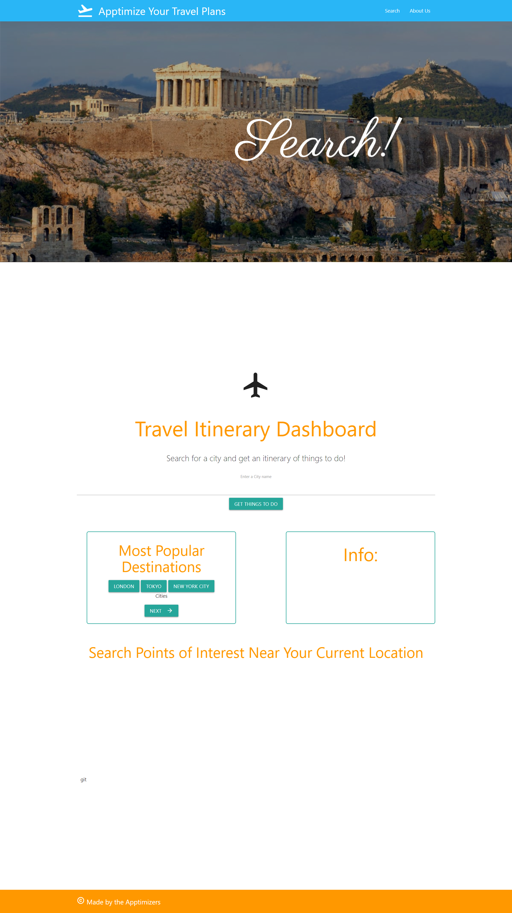

# Travel-Optimizer

Welcome to The Travel Optimizer, created by The Apptimizers!
Our application will allow travelers to quickly plug their destination into the search to pull Points of Interest from those cities. One click on the Point of Interest will display a photo of that POI, along with a quick description. Clicking on the "Show more at OpenTripMap" link below each description will link you to that POI's location on an external map.

At the bottom of the page, you will find a custom satellite view map for scanning local POI's. Just click on the location button on the map and allow the map to use your current location. The map will then let you see nearby lodging, restaurants, historic sites, and more!

Have fun, and Safe Travels!

## Repository

https://github.com/Maryjezek/travel-optimizer.git

## Webpage

https://maryjezek.github.io/travel-optimizer/



## Gif

<p align="center">

</p>

## User Story

```
AS A traveler
I WANT to see query locations I want to visit and be able to locate them on a map
SO THAT I can plan a trip to that location
```

## Larger ambitions which were not accomplished (yet)

Give the time and the coding acuity, we would have liked to query a map with multiple points of interest and plot out an itinerary. We have accomplished the steps towards that, but it is a bit ambitious to say the least.

The web app utilizes a map API together with an API that returns the attractions in a city. The city results are clickable, and, when clicked, return two items: on the right is a summary of the attraction and a picture. Below it is the location on a map.

## Description of Code

The webpage utilizes HTML, CSS, and JavaScript in order to perform its tasks. In addition, various APIS and libraries are used

### Materialize

Materialize is used for styling. It has a CSS library and JS library to perform various styling functions.

### Mapbox

Mapbox is an API and accompanying JS and CSS libraries, used for the map display.

### Open Tri Map

Open Tri Map is an API which returns local attractions

### JQuery

A JavaScript library for ease of coding

## Features

### Local Storage

Local Storage is first accessed when the application accesses storage to be displayed as past searches.

Local Storage is again accessed any time a search is performed, the application accesses local storage and adds the item to the local storage.

### Fetch Requests

Multiple API requests are made in the code in order to display the content. There is first a request to the city to grab its latitude and longitude. The lat and lon initiate another API request for attractions in the area. A third API request is initiated to displayed information when an attraction is clicked. There is a separate update of the Map at the bottom, utilizes a function declared in the mapbox library.

## Citations:
Portions of this code were provided by the API's we utilized in our project. Portions may have been modified. Instances of borrowing code from external sources have been marked as such in the JavaScript.
